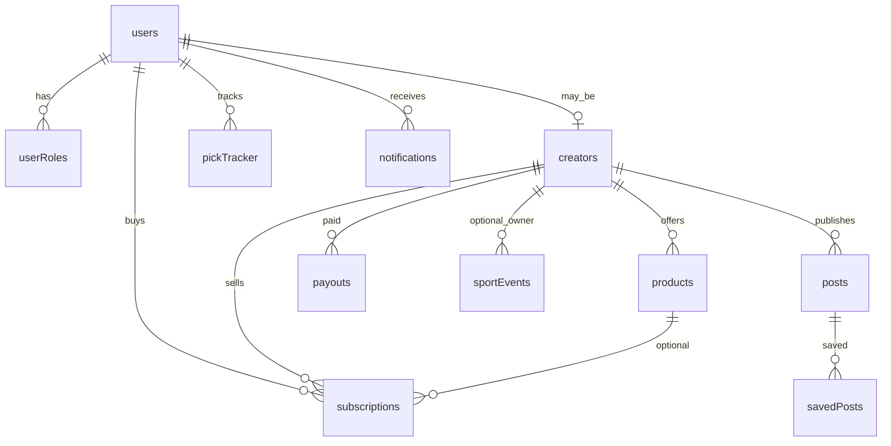

# Target Data Model (Convex-first)

Given no Supabase admin access, the **target authoritative DB is Convex**.

## Entities (keep + extend)

Existing Convex tables remain. Additions:

| Table / field | Purpose |
|---------------|---------|
| `subscriptions.productId` | Link purchase to product |
| `pickTracker.postId` | Optional link to creator post |
| `posts.result` / `pickTracker.result` | Constrained: `pending\|won\|lost\|push` (normalize picks) |
| `sportEvents` | Today’s events slate |
| `paymentEvents` | Ledger for earnings/admin transactions |
| `creators.verificationStatus` | verified \| pending \| none |
| `postProducts` | optional M:N post→product targeting |
| `idMaps` (optional) | legacy UUID ↔ Convex Id for ETL |

## Identity rule (normalize)

```text
externalAuthId (Supabase auth uid OR Convex Auth subject)
  → users._id
All FKs use users._id (including notifications, pickTracker, bookmarks)
```

## Money

Integer cents everywhere. Fee split only in trusted mutations.

## ERD (core)



Full matrix in `06` companions — see also `decisions` in database-migration.
